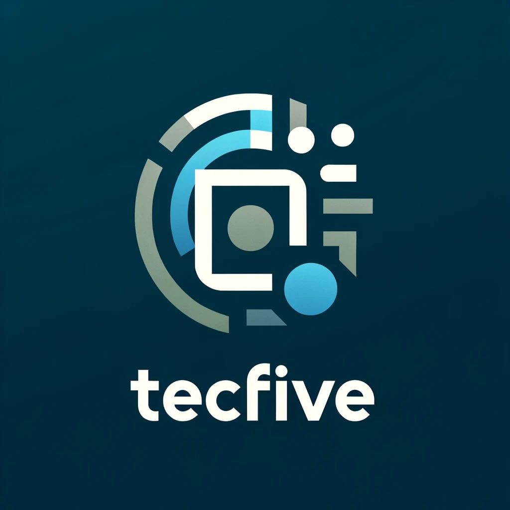

# Somos TecFive
Innovación y soluciones a tu alcance

# Integrantes y roles

* Francisco Javier Lugo Gutiérrez - Tech Lead
* David Julio Faudoa González - Scrum Master
* Mario Raúl Fernández Calleros - 
* Patricio Villarreal Welsh - Product Owner
* José Antonio Ramírez Oliva - 

# Proceso de colaboración

* Crear un branch para el trabajo a realizar
* Utilizar el branch hasta completar el trabajo para no interferir con el trabajo de otros
* Al finalizar el trabajo, hacer un pull request para integrarlo a main
* Borrar la branch

# Repo de trabajo
* [https://github.com/TecFive/DREAM-Lab](Aquí)
